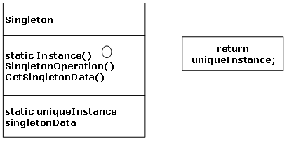

.. contents:: Table of Contents

Singleton Design Pattern
========================

.. sectnum::
Intent
------
Ensure a class has only one instance, and provide a global point of access to it.

Motivation
----------
It is important for some classes to have exactly one instance.
How do we ensure that a class has only one instance and that the instance is easily accessible? 
A global variable makes an object accessible, but it does not keep you from instantiating multiple objects.
A better solution is to make the class itself responsible for keeping track of its sole instance.
The class can ensure that no other instance can be created (by intercepting requests to create new objects), and it can provide a way to access the instance. 
This is the Singleton pattern.

Applicability
-------------
Use the Singleton pattern when
- There must be exactly one instance of a class, and it must be accessible to clients from a well-known access point.
- When the sole instance should be extensible by subclassing, and clients should be able to use an extended instance without modifying their code.

Structure
---------

Participants
------------
**Singleton**
Defines an Instance operation that lets clients access its unique instance. Instance is a class operation (a static member function in C++).

Collaborations
--------------
Clients access a Singleton instance solely through Singleton's Instance operation.

